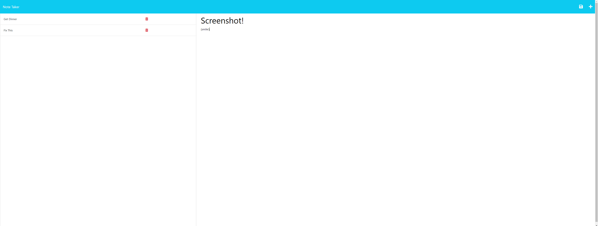

# Note-taker

A note-taking application to organize thoughts and track tasks.
Link to deployed application: https://note-taker-11rb.onrender.com

## Navigation
- [User-Story](#user-story)
- [Description](#description)
- [Author](#author)

## User-Story

AS A small business owner
I WANT to be able to write and save notes
SO THAT I can organize my thoughts and keep track of tasks I need to complete

## Description

A note-taking application that opens with a landing page that navigates to a notes page, which stores the notes on the left side, while presenting fields to the right for titling and detailing new notes to save.

## Author

Gregory Quinn Roth - https://github.com/rothgq